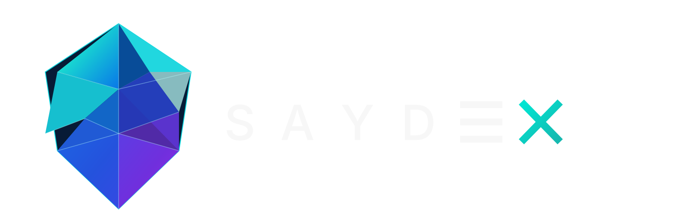

<div align="center">
  
  <h1>Saydex Protocol</h1>
  <p><strong>Next-Generation Concentrated Liquidity Decentralized Exchange & Multi-Chain DeFi Terminal</strong></p>

  <p>
    <a href="https://www.saydex.site"></a>
    <a href="https://github.com/Sayed01740/Saydex/blob/main/LICENSE"></a>
    
    
  </p>
</div>

---

## Overview

**Saydex Protocol** is a non-custodial decentralized exchange (DEX) interface and execution terminal designed for optimal capital efficiency, deep concentrated liquidity, and institutional-grade routing.

Built natively on top of audited Uniswap V3 core contracts and next-generation Uniswap V4 Universal Router execution pipelines, Saydex empowers traders and liquidity providers across EVM networks with minimal slippage, sub-second rate resolution, and direct on-chain settlement.

- **Production Interface:** [https://www.saydex.site](https://www.saydex.site)
- **Documentation & Specs:** [https://www.saydex.site](https://www.saydex.site)
- **Supported Standards:** ERC-20, ERC-721 (LP Positions), Permit2, EIP-1193, EIP-1559

---

## Key Highlights

- **Concentrated Liquidity (Uniswap V3 Engine):** Allocate capital within customized price ranges, achieving up to 4000x greater capital efficiency compared to traditional constant-product AMMs.
- **Uniswap V4 Universal Router:** Support for single-transaction atomic calldata execution pipelines combining Permit2 approvals, exact input/output swaps, and multi-protocol settlement.
- **Smart Order Routing (SOR):** Dynamic algorithm evaluating direct pool liquidity, multi-hop paths, and fee tiers (0.01%, 0.05%, 0.30%, 1.00%) to ensure minimal price impact and lowest gas consumption.
- **Real-Time Live Gas & Pricing Engine:** Sub-second gas price monitoring across all supported chains directly queryable via on-chain RPC nodes and aggregated feeds.
- **Private RPC & MEV Shielding:** Transaction routing designed to mitigate front-running and sandwich attacks with user-configurable slippage safeguards and deadline protection.
- **Comprehensive EVM Network Coverage:** Seamless switching between Ethereum, Arbitrum One, Optimism, Base, Polygon, BNB Chain, Avalanche, and testnet environments with auto-failover RPC pools.
- **Non-Custodial Architecture:** Direct self-custody wallet connection supporting MetaMask, Coinbase Wallet, Phantom, Rabby, Ledger, and WalletConnect v2.

---

## Contract Deployments

Saydex routes trades directly through battle-tested, verified on-chain deployments across major networks:

| Network | Chain ID | Factory | SwapRouter02 | NonfungiblePositionManager | Universal Router (v4) |
| :--- | :--- | :--- | :--- | :--- | :--- |
| **Ethereum Mainnet** | `1` | `0x1F98431c8aD98523631AE4a59f267346ea31F984` | `0x68b3465833fb72A70ecDF485E0e4C7bD8665Fc45` | `0xC36442b4a4522E871399CD717aBDD847Ab11FE88` | `0x3fC91A3afd70395Cd496C647d5a6CC9D4B2b7FAD` |
| **Arbitrum One** | `42161` | `0x1F98431c8aD98523631AE4a59f267346ea31F984` | `0x68b3465833fb72A70ecDF485E0e4C7bD8665Fc45` | `0xC36442b4a4522E871399CD717aBDD847Ab11FE88` | `0x4C60051384bd2d3C01bfc845Cf5F4b44bcbE9de5` |
| **Optimism** | `10` | `0x1F98431c8aD98523631AE4a59f267346ea31F984` | `0x68b3465833fb72A70ecDF485E0e4C7bD8665Fc45` | `0xC36442b4a4522E871399CD717aBDD847Ab11FE88` | `0xb555edF5dcF85f42cEeF1f3630752A1043946B31` |
| **Polygon PoS** | `137` | `0x1F98431c8aD98523631AE4a59f267346ea31F984` | `0x68b3465833fb72A70ecDF485E0e4C7bD8665Fc45` | `0xC36442b4a4522E871399CD717aBDD847Ab11FE88` | `0x643770E279d5D0733F21d6DC03A8efbABf325530` |
| **Base** | `8453` | `0x33128a8fC17869897dcE68Ed026d694621f6FDfD` | `0x2626664c2603336E57B271c5C0b26F421741e481` | `0x03a520b32C04BF3bEEf7BEb72E919cf822Ed34f1` | `0x198EF79F1F515F02dFE9e3115e9F80783D5d5048` |
| **BNB Smart Chain** | `56` | `0xdB1d10011AD0Ff90774D0C6Bb92e5C5c8b4461F7` | `0xB971eF87ede563556b2ED4b1C0b0019111Dd85d2` | `0x7b8A01B39D58278b5DE7e48c8449c9f4F5170613` | `0x1A1ec25DC1Ba42e659436873372825220260799c` |
| **Sepolia Testnet** | `11155111` | `0x0227628f3F023643471bDG80f12...` | `0x3bFA4769FB09eefC5a80d6E87c3B9C650f7Ae48E` | `0x1238536071E1c677A632429e3655c799b22cDA52` | `0x3fC91A3afd70395Cd496C647d5a6CC9D4B2b7FAD` |

---

## Architecture & Technology Stack

The interface is engineered with a focus on determinism, zero client-side lag, and clean, responsive accessibility:

- **Framework:** React 19 + TypeScript (Strict Type Safety)
- **Bundler & Build Tool:** Vite 6 with optimized code splitting and dynamic chunking
- **Styling System:** Vanilla CSS Design Tokens + TailwindCSS v4 with Inter typography
- **State Architecture:** Context-driven decoupled providers (`WalletContext`, `ProtocolContext`, `ThemeContext`)
- **Web3 Layer:** Direct JSON-RPC multi-provider abstraction with fallback telemetry and automated health checking
- **Analytics & Charts:** High-performance responsive charting powered by Recharts

---

## Local Development

### Prerequisites

- [Node.js](https://nodejs.org/) (version `18.x` or later recommended)
- `npm`, `pnpm`, or `bun`

### Setup Instructions

1. **Clone the repository:**
   ```bash
   git clone https://github.com/Sayed01740/Saydex.git
   cd Saydex
   ```

2. **Install project dependencies:**
   ```bash
   npm install
   ```

3. **Configure Environment Variables (Optional):**
   Copy the example environment configuration:
   ```bash
   cp .env.example .env.local
   ```
   *Note: Saydex is fully functional out of the box with public on-chain RPC endpoints. Custom RPC endpoints (Alchemy, Infura, QuickNode) can be specified for higher rate limits.*

4. **Start the local development server:**
   ```bash
   npm run dev
   ```
   Open [http://localhost:3000](http://localhost:3000) in your browser.

5. **Typecheck & Production Build:**
   ```bash
   npm run lint    # Run TypeScript checks
   npm run build   # Generate minified production bundle in /dist
   ```

---

## Security & Responsible Disclosure

Security is fundamental to decentralized finance. 

- **Smart Contracts:** Saydex does not hold custody of user funds at any point. All asset movements are authorized directly by the user's wallet via standardized EVM `approve` / `permit` signatures and routed through audited, open-source Uniswap V3/V4 smart contracts.
- **Reporting Vulnerabilities:** If you discover a security vulnerability or potential threat within the client interface, please report it responsibly by contacting `security@saydex.site` or submitting a confidential security advisory via GitHub.

---

## License

This project is licensed under the **MIT License** — see the [LICENSE](LICENSE) file for full details.

---

<div align="center">
  <sub>Built for the decentralized future. Powered by Saydex Protocol.</sub>
</div>
